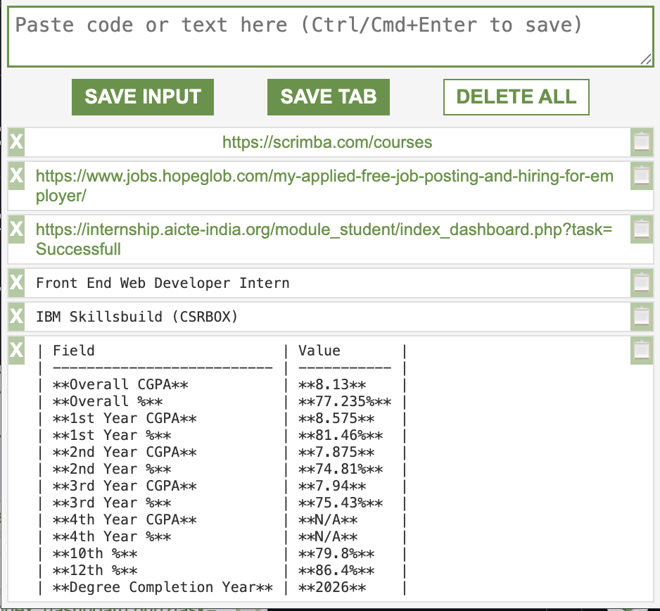

# 🚀 Leads Tracker – Lightweight Chrome Extension
* A clean and lightweight Chrome extension designed to quickly **save text snippets, code, and current tabs** with a single click.
* Perfect for developers, researchers, students, and anyone who needs quick-access bookmarks and code storage directly inside their browser.


---

## 🌟 Features

### 1. ✨ Save Any Text or Code
Simply paste any content—code snippets, URLs, meeting notes, or ideas—into the input box and save it instantly.

### 2. 🔖 One-Click “Save Current Tab”
Quickly bookmark your active research or reference page. Save the current tab's URL and title by:
* Pressing the **Down Arrow ↓** keyboard shortcut.
* Clicking the **SAVE TAB** button in the popup.

### 3. 📋 Copy to Clipboard
Every saved item features a fast “Copy” button for easy transfer of the lead's content.

### 4. 🗑️ Deletion Options
* **Delete All:** Double-click the dedicated **Delete** button to clear your entire list.
* **Delete Single Item:** Use the **❌** button next to any lead to remove it individually.

### 5. ⌨️ Smart Keyboard Shortcuts

| Shortcut | Action |
| :--- | :--- |
| **Ctrl/Cmd + Enter** | Save the text in the input box |
| **Arrow Down ↓** | Save the current tab (URL + Title) |
| **Arrow Up ↑** | Delete the last item in the list |

### 6. 💾 Auto-Save with LocalStorage
Your saved leads list persists automatically, even after closing and reopening Chrome.

---

## 📂 Project Structure

```
leads-tracker-extension/
├── index.html        # Popup UI markup and structure
├── main.js           # Core logic, DOM manipulation, and chrome.tabs API usage
├── style.css         # Styling for the extension's popup
├── manifest.json     # Extension metadata (Manifest V3)
└── icon.png          # Extension icon (e.g., 128x128)
```

---

## 🛠️ How It Works

### 🔧 Manifest V3

The extension uses Manifest V3 and requires the `tabs` permission to access the URL and title of the active tab.

```json
{
  "manifest_version": 3,
  "version": "1.0",
  "name": "Leads Tracker",
  "permissions": ["tabs"],
  "action": {
    "default_popup": "index.html",
    "default_icon": "icon.png"
  }
}
```

### 🧠 Storage & Lead Format

The extension uses the browser's native local storage for persistence.

#### 💾 Storage Key
All saved leads (the array of lead objects) are stored under the following key:

`localStorage.myLeads`

#### 📑 Lead Object Format
The `myLeads` array contains objects structured as follows. The `type` key determines how the lead is displayed in the popup (e.g., as code or a clickable link).

| Key | Description | Possible Value (Type) |
| :--- | :--- | :--- |
| **`value`** | The content of the lead. | String (URL for tabs, or text for snippets) |
| **`type`** | Indicates the source/purpose of the lead. | String (`"text"` or `"tab"`) |

**Example Lead Object:**

```json
{
  "value": "https://github.com/myusername/leads-tracker-extension",
  "type": "tab"
}
```

---

## 📥 Installation (Developer Mode)

To install this extension locally in your Chrome browser:

1.  **Clone the repository:**
    ```bash
    git clone [https://github.com/yourusername/leads-tracker-extension.git](https://github.com/yourusername/leads-tracker-extension.git)
    ```

2.  **Open Chrome Extensions:**
    * Navigate to `chrome://extensions` in your browser.
    * Alternatively, go to Menu (⋮) → Extensions → Manage Extensions.

3.  **Enable Developer Mode:**
    * Toggle the **Developer mode** switch in the top right corner.

4.  **Load Unpacked:**
    * Click the **Load unpacked** button.
    * Select the `leads-tracker-extension` folder you cloned.

🎉 Your **Leads Tracker** extension is now installed and ready to use!

---

## 🧪 Upcoming Improvements

We are planning the following enhancements:

* Export leads to JSON / CSV formats.
* User interface for keyboard shortcut customization.
* Dark mode toggle.
* **Replacing `localStorage` with `chrome.storage.sync`** for better native extension storage.

---

## 🤝 Contribute

We welcome contributions, suggestions, and bug reports!

1.  Feel free to **open issues** for bugs, features, or improvements.
2.  Submit **Pull Requests (PRs)** to contribute code.

All enhancements, bug fixes, and UI improvements are appreciated!

---

## 📄 License

This project is licensed under the **MIT License**.
